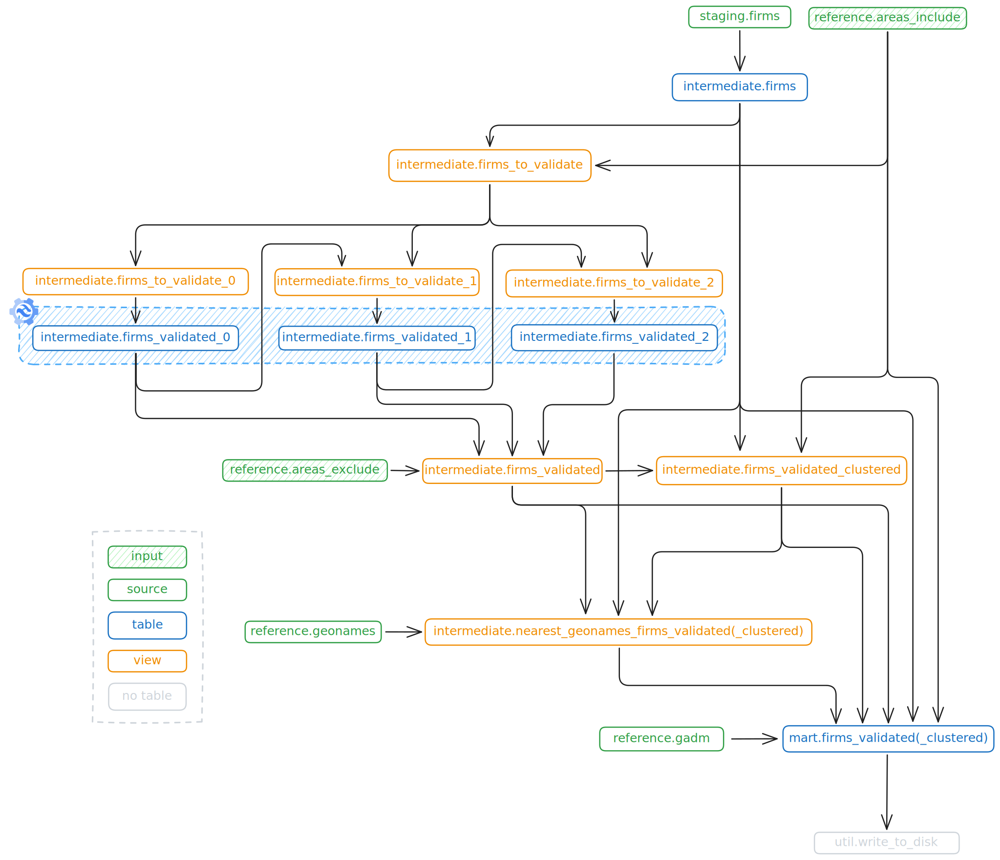

# 🔥 Burnscar Detection Pipeline

[](LICENSE)
[](https://www.python.org/downloads/)

This project identifies potential arson incidents using NASA FIRMS active fire alerts, filtered and validated with post-event burn scar imagery from Copernicus Sentinel-2. It uses geospatial joins, temporal validation, and clustering to produce a reliable dataset of suspicious fires. The data pipeline is powered by **[SQLMesh](https://sqlmesh.com/)**.

---

## 🧠 Pipeline Summary

1. **Fetch** fire alerts from NASA FIRMS.
2. **Filter** alerts spatially using spatial filter. (usually urban areas)
3. **Validate** detections via Sentinel-2 imagery (Google Earth Engine).
4. **Cluster** validated points by date and to urban areas.
5. **Export** clean datasets of verified and clustered fires.

---

## 📦 Requirements

Before you begin:

- **NASA FIRMS API key**: Register for a [free API key](https://firms.modaps.eosdis.nasa.gov/api/map_key/). This is required to fetch fire detections from the NASA API. Copy [example.env](./example.env) to [.env](./.env) and fill in your acquired API key.
- **Google Earth Engine access**: We use Google Earth Engine to provide and analyse imagery from ESA's Sentinel-2 satellite. You need to register a (free for non-commercial) [Earth Engine project](https://developers.google.com/earth-engine/guides/access) on Google Cloud. To get the key follow these steps:
  1. Go to the [GCP Console](https://console.cloud.google.com) &rarr; Select/Create your project &rarr; APIs \& services &rarr; Google Earth Engine API &rarr; Credentials &rarr; Under Service accounts &rarr; Select/Create service account &rarr; Keys &rarr; Add key &rarr; json
  2. Put the downloaded json file in the root of the project (configurable, default: [key.json](./key.json)).


- [uv](https://github.com/astral-sh/uv) (for installation, virtual environment and dependency management)

---

## 🚀 Quickstart

### 1. Clone this repository

```bash
git clone https://github.com/Centre-for-Information-Resilience/Fire_mapping
````

### 2. Add credentials
See Requirements section.

### 3. Configure project
For configuration of the project refer to the SQLMesh [config file](./sqlmesh/config.yaml). The following configuration options are currently available:

- `model_defaults`:
  - `start`: Set the start date of the project.
- `variables`
    - `ee_key_path`: Path to your Service Account Key (`json`) See Requirements section on how to obtain this file
    - `ee_concurrency`: Max number of threads used for fetching data from gee. 50 uses ~1.5GB of RAM
    - `country_id`: 3-letter ISO country code
    - `gadm_level`: GADM administrative areas level (between 1 and 3). Some countries don't have higher levels available

    - `validation_lookback`: How many days back to look when running the pipeline. e.g. 60 will fetch and validate fires up to 60 days ago

    - `validation_params`:
        - `buffer_distance`: Area in meters around fire to use for validation
        - `days_around`: Days before and after the event to consider for validation
        - `max_cloudy_percentage`: Maximum allowed cloud cover for images used in validation
        - `burnt_pixel_count_threshold`: Required amount of burnt pixels to label as `burn_scar_detected`
        - `max_nbr_after`: -0.10
        - `min_nbr_difference`: 0.15

    - `clustering_max_date_gap`: Maximum gap between two consecutive FIRMS events used for clustering

    - `path_gadm`: Path to write gadm .gpkg files to
    - `path_geonames`: Path to write geonames .gpkg file
    - `path_output`: Path to write output to

    - `paths_areas`:
        - `include`: Path to inclusion areas .gpkg
        - `exclude`: Path to exclusion areas .gpkg 


### 3. Run the SQLMesh pipeline
For first time usage run:

```bash
uv run burnscar init
```
For subsequent runs you can use:
```bash
uv run burnscar run
```
These are two cli commands included for convenience, of course you can also just run the SQLMesh project directly. Make sure you're in [`sqlmesh/`](./sqlmesh/) and run:
```bash
uv run sqlmesh --help
```

### 4. Inspect the results

- Outputs are saved in the configured directory:
  - `firms_output.csv`: all validated fire detections
  - `output_clustered.csv`: clustered detections by date and location
- You can explore the `sqlmesh/db.db` database with:
  - [DuckDB CLI](https://duckdb.org/2025/03/12/duckdb-ui.html): `duckdb sqlmesh/db.db -ui`
  - [marimo](https://marimo.io): `uvx marimo edit explore.py --sandbox`

---

## 📂 Project Structure

```text
docs/               # DAG Schema and validation notebook
sqlmesh/            # SQLMesh config, models, macros
src/burnscar/       # Python source (fetchers, validators, logic)
```

---

## 🗺️ Data Sources

* **FIRMS** – NASA MODIS/VIIRS fire alerts: [nasa.gov](https://firms.modaps.eosdis.nasa.gov/map)
* **Copernicus Sentinel-2** – Post-burn surface reflectance: Accessed through Google Earth Engine, but can be explored using [Copernicus Browser](https://browser.dataspace.copernicus.eu)
* **GADM** – Global administrative boundaries: [gadm.org](https://gadm.org/)
* **GeoNames** - Open database of placenames: [geonames.org](https://www.geonames.org/)

---

## 🗃️ SQLMesh Model DAG


---

## 📜 License

MIT License — free to use, modify, and distribute.

## 🌟 Credits
This project was made possible thanks to the foundational research and work of:
- [Michael Cruickshank](https://github.com/MJCruickshank)
- Mustafa A
- [Tarig Ali](https://github.com/tariqabuobeida)
- Mark Snoeck